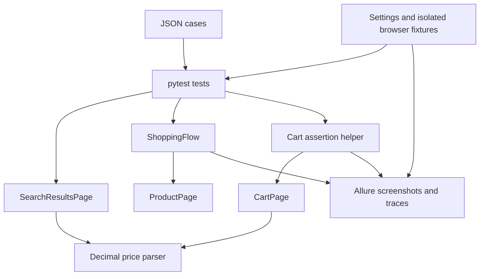

# Architecture

Python, synchronous Playwright, pytest, JSON data, and Allure. Local execution only.

## Responsibilities

| Component | Responsibility |
| --- | --- |
| `pages/search_results_page.py` | Search, visible price filter, XPath result extraction, pagination |
| `pages/product_page.py` | Available variant selection and cart-addition confirmation |
| `pages/cart_page.py` | Open the cart and read its displayed item count and subtotal |
| `pages/ebay_error_page.py` | Recognize eBay's known error and use its Home control |
| `pages/base_page.py` | Shared page access and navigation |
| `flows/shopping_flow.py` | Visit every supplied URL, record additions, return to search |
| `utils/cart_assertions.py` | `assert_cart_total_not_exceeds`: exact count and subtotal budget |
| `utils/money.py` | Strict ILS parsing with `Decimal` |
| `utils/data_loader.py` | Validate external test data before browser interaction |
| `utils/evidence.py` | Best-effort screenshots and trace attachments |
| `conftest.py` | JSON parametrization, isolated contexts, seeds, and evidence lifecycle |
| `tests/e2e/` | Search expectations and the combined add-to-cart/subtotal scenario |

## Lifecycle

The official pytest-playwright plugin owns the browser and closes each context.
Our context fixture sets timeouts and starts tracing, then attaches the trace before
plugin cleanup. The report hook captures setup/call failures while the page is open.
Explicit checkpoints capture search, item, and cart evidence. Screenshot failures log
warnings without replacing the original test result.

Each case receives a fresh guest context. The random seed combines `EBAY_RANDOM_SEED`
with a stable hash of the test ID and is recorded in Allure. No persistent login is loaded.

## Business rules

- Search types minimum zero and the requested maximum into the visible ILS fields,
  commits with Tab, submits the price filter, and verifies `_udhi` before extraction.
- Result cards are read through XPath. Each price is checked locally; ambiguous prices
  are excluded. URLs are unique and pagination stops at the limit or end of results.
- Three search rows cover five results, zero results, and 65 results across two pages.
  The separate cart row requires every one of five returned URLs.
- Product selections use available variants. Confirmed additions receive a log and screenshot.
- Cart verification reads the site's Subtotal, including its displayed shipping charges.
  It requires the expected item count and compares against `budget_per_item * items_count`.
  Selected-variant price changes are reflected in this final comparison.
- Shipping can make the scenario exceed its budget even when all search prices qualify.
  This is an assertion failure, not a reason to reduce coverage or change the threshold.
- Missing, ambiguous, or non-ILS cart values fail; an empty cart cannot pass the shopping case.
- Known initial search/product errors allow one recovery through Home. A failed return to
  search may continue from Home without repeating a confirmed addition. No CAPTCHA bypass.

## Remaining scope

Identification as an explicit Guest function and the bug-review exercise remain pending.
The assignment's unaided bug-review condition must not be claimed for assisted work.
See [HANDOFF.md](../HANDOFF.md) for current verification and limitations.
