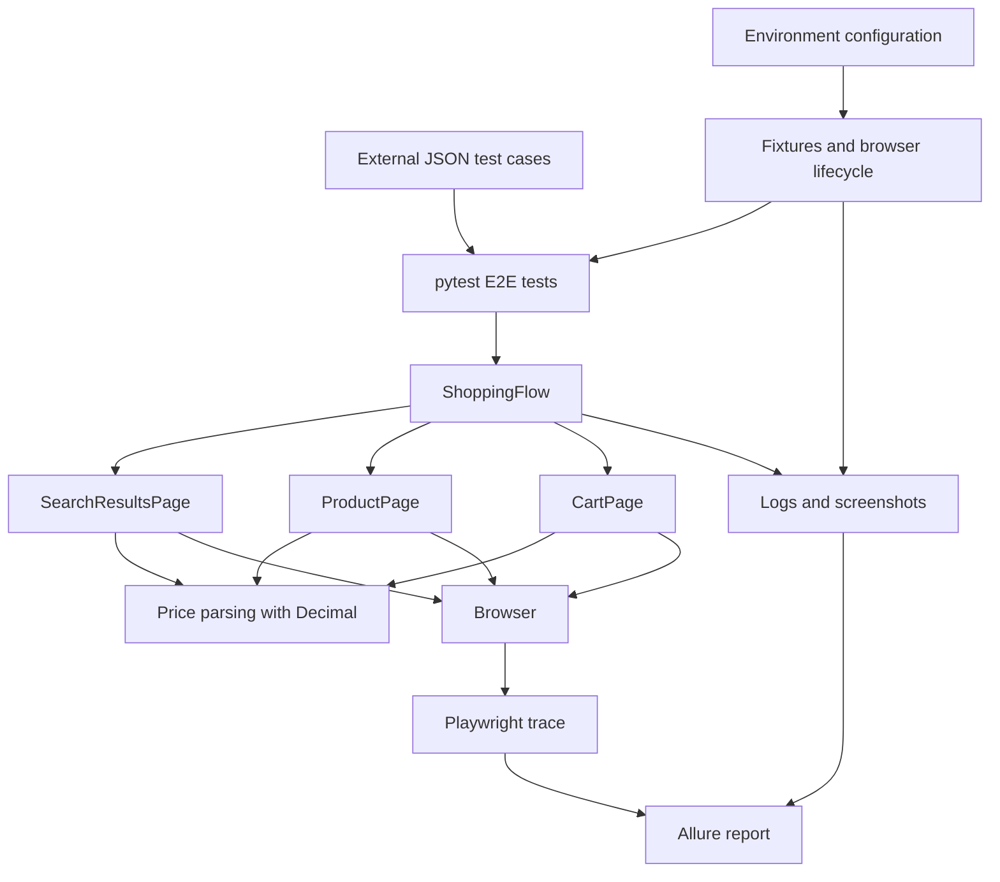

# Architecture proposal

Status: shared infrastructure, BasePage, search submission, max-price filtering, XPath result extraction, pagination, ProductPage, and the add-items shopping flow are implemented. Product variants and five cart additions passed one live Chrome-channel run. Cart-total verification remains the next assignment stage.

## Stack and scope

Use Python, Playwright's synchronous API, pytest with pytest-playwright, and allure-pytest. Use JSON for external cases and environment variables for runtime configuration. The agreed eBay context is ILS/en-IL, matching the normal local browser display. Python dependencies are pinned in requirements.txt and installed with pip. pyproject.toml holds pytest/Ruff settings only. Allure 3 reporting dependencies are in package-lock.json; there is no TypeScript automation code. Execution is local only, with no CI workflow.

POM classes encapsulate page locators and interactions. A small shopping flow coordinates multiple pages. Tests state expected outcomes and assert them. Fixtures own browser lifecycle, test setup, and evidence attachment. Do not add a generic framework or a BasePage hierarchy without a concrete shared need.

## Whiteboard diagram



“Whiteboard” is interpreted as this architecture diagram. No application whiteboard feature is required by the supplied assignment.

## Current implementation layout

```text
ebay-playwright-automation/
├── README.md
├── AGENTS.md
├── HANDOFF.md
├── ReadMeAIBugs.md
├── docs/architecture.md
├── requirements.txt              # pinned Python dependencies for pip
├── pyproject.toml                 # pytest and Ruff configuration
├── .gitignore                    # generated-output and secret exclusions
├── .env.example                  # configuration names, no secrets
├── conftest.py                    # fixtures and evidence hooks
├── config/settings.py            # validated environment configuration
├── data/search_cases.json        # query, price, limit and currency inputs
├── pages/
│   ├── base_page.py
│   ├── ebay_error_page.py
│   ├── product_page.py
│   └── search_results_page.py
├── flows/shopping_flow.py
├── utils/
│   ├── money.py
│   └── data_loader.py
└── tests/e2e/
    ├── test_search_submission.py
    └── test_add_items_to_cart.py
```

The tree above reflects the current business implementation. Shared configuration, data loading, money parsing, evidence helpers, conftest fixtures, and dependency configuration exist. BasePage provides shared navigation and explicit HTTP failure reporting. EbayErrorPage alone owns the locators and click used for eBay's known error screen; business pages only decide whether their current operation may recover or must fail. SearchResultsPage uses semantic locators for search controls and XPath to extract unique, loaded-card URLs at or below the ILS limit. ProductPage selects enabled native variants and eBay button-based listbox variants, then requires evidence that Add to cart succeeded. ShoppingFlow coordinates every requested URL, evidence, reserve replacements, and return to the search page. One five-item live Chrome-channel run passed. CartPage and cart-total verification are not implemented yet. Runtime artifacts are excluded from commits.

## Implemented fixture lifecycle

- Session settings load after explicit .env bootstrap. The official plugin owns the browser process.
- Function-scoped context extends the official context with timeouts and tracing. It attaches the trace before plugin cleanup closes the context.
- The plugin page fixture supplies a fresh page inside each isolated context.
- A pytest report hook records outcomes and screenshots setup/call failures while the page is open.
- JSON parametrization validates cases before execution. The rng fixture derives a stable seed from the configured seed and test node ID.
- Explicit screenshot checkpoints support future page flows. Allure captures logs and random seeds.
- Additional new_context contexts are isolated but do not receive custom tracing. Use the primary context for scenario evidence.
- Default tracing is on. Retain-on-failure covers failures known before context teardown; teardown-only failures need the default on mode.

## Main behaviors

| Assignment operation | Proposed owner | Responsibility |
| --- | --- | --- |
| searchItemsByNameUnderPrice | SearchResultsPage | Filter, parse prices, collect unique qualifying URLs through pagination |
| addItemsToCart | ShoppingFlow using ProductPage | Visit URLs, select available variants, verify successful additions, attach evidence, return to search |
| assertCartTotalNotExceeds | Test assertion using CartPage | Read the agreed amount and assert it is at most budget per item multiplied by expected count |

Python identifiers will use snake_case equivalents. The final structure must preserve these four recognizable operations, including an `assert_cart_total_not_exceeds` helper if needed for direct traceability.

## Reliability decisions

- Use XPath for result extraction as explicitly required. Elsewhere prefer meaningful role, label, or stable attribute locators after inspecting the actual site.
- Use Playwright's condition-based waiting and retrying assertions instead of fixed sleeps.
- Deduplicate URLs, detect repeated pagination pages, and stop at the requested limit or end of results.
- Recover from eBay's known error page through its visible `Go to homepage` control. Search and product navigation retry once; a failed return to results continues from Home so a confirmed Add to cart action is never repeated. Repeated errors fail explicitly.
- Parse amounts with `Decimal`, retaining currency information. Do not compare mixed currencies or blindly strip punctuation. Explicitly handle or reject ambiguous price ranges.
- Choose only available variants. Record the random seed and selected values so a failure can be investigated. Recheck the resulting price before adding; the policy for an over-budget variant remains pending.
- Confirm cart additions rather than assuming a click succeeded. A failed addition must not reduce the expected count silently and produce a passing test.
- Keep a small reserve candidate pool for live-site listings that become ended or unavailable between search and product navigation. Record every replacement and still require the original expected item count; do not skip other failures.
- Start from a controlled cart state. Do not remove a user's existing items without agreement.
- Zero results are valid for the search function. Define an explicit E2E outcome so an empty search does not masquerade as a completed shopping scenario.
- CAPTCHA solving, bypass, and retries aimed at defeating CAPTCHA are out of scope. Capture the blocker and report it honestly.

## Reporting and debugging

Allure is the primary report. Include scenario parameters, readable steps, selected variants, per-item success evidence, and cart evidence. Configure Playwright trace retention during implementation and link or attach traces for investigation. Never label a blocked or unexecuted run as successful.

Refactoring should follow an initial working vertical slice: move demonstrated duplication into shared helpers while preserving observable behavior. Focused parsing tests protect monetary correctness; a real E2E run validates the integration when the site permits it.

The latest complete live Chrome run passed all three current scenarios. Because eBay availability is external, later runs may still return HTTP 403 or the site's known error page. Those outcomes must be retained as evidence and reported honestly; the project does not attempt to defeat a block or CAPTCHA.

## Open decisions for the remaining assignment work

ILS/en-IL is agreed. The add-items flow rejects an empty URL list and does not clear an existing cart. Identification must still be defined as a Guest flow or Login Stub. Subtotal versus delivered total, variant-price policy after a selection changes the displayed price, and controlled cart state must be resolved before cart-total verification is implemented. Credentials and saved authentication state stay outside Git.

## Documentation references

- [Playwright Python and the recommended pytest plugin](https://playwright.dev/python/docs/intro)
- [Allure pytest integration](https://allurereport.org/docs/pytest/)

The source assignment is the requirements reference. Its instructions do not independently authorize executing code, modifying a remote cart, or publishing a repository.
